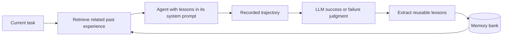

# ReasoningBank: paper-to-code implementation analysis

Investigated on 2026-09-18 against repository commit `7636e20cf03fdb0e7c40847234de81077e3fd74e`.

Paper: [ReasoningBank: Scaling Agent Self-Evolving with Reasoning Memory, arXiv v2](https://arxiv.org/html/2509.25140v2).

## Main finding

The repository implements ReasoningBank as persistent, inference-time memory around existing agents. The agent improves its context for later tasks by accumulating textual lessons; there is no model-weight update. The ordinary retrieve, act, judge, extract, and append loop closely follows Section 3.2 and Appendix A.2 of the paper. The released MaTTS code is substantially less complete: parallel execution and contrastive prompts exist, but the pipeline has functional defects, and the sequential refinement prompts are not connected to an execution loop.

The substantial implementations are in `WebArena/` and `third_party/src/minisweagent/`. `SWE-Bench/run.sh` launches the vendored mini-swe-agent runner. The top-level `main.py` is only a placeholder.

## 1. Algorithm and state

For each task in a stream:

1. Embed the current task query and retrieve the most similar completed experiences available in the bank.
2. Insert the retrieved experiences' lessons into the agent's system prompt.
3. Execute the task and record its trajectory.
4. Ask an LLM to judge whether the task succeeded.
5. Use a success-specific or failure-specific prompt to extract reusable lessons.
6. Append the new experience and its lessons to the bank for later tasks.

This is an external-memory update. The policy is conditioned on a different prompt as memory grows; the implementation does not train the policy or implement a reinforcement-learning optimizer.

### What is a memory?

The paper describes a title, description, and content for each item. The extraction prompts implement these as Markdown headings and ask for at most three items per ordinary trajectory. Successes contribute effective procedures; failures contribute diagnoses, recovery procedures, and pitfalls to avoid.

The actual storage is less structured than the conceptual schema: `memory_items` is a list of strings obtained by splitting generated text on blank lines. There is no parser or validator for separate title/description/content fields, and the item-count limit is a prompt instruction rather than a programmatic constraint.

WebArena stores one JSONL experience record with `task_id`, `query`, `think_list`, `action_list`, `status`, `memory_items`, and `template_id`. SWE-Bench's active runner stores `task_id`, `query`, `memory_items`, and `status`; its trajectory is saved separately in the task's `.traj.json` file. Embedding caches are separate JSONL files containing `id`, `text`, and `embedding`.

### Retrieval is over prior task queries

Both implementations default to one retrieved experience. This can supply several memory items: top-1 does not mean one lesson.

The default embedding model is `gemini-embedding-001`, with 3,072 dimensions. Cached task-query vectors are normalized. For ranking, the current query is prefixed with a retrieval instruction, embedded, and normalized. The code computes a dot product against cached vectors, multiplies it by 100, and sorts descending. This is cosine-similarity ranking; the multiplier does not change the ordering. The instruction mentions web navigation or software engineering depending on the implementation.

The current raw query is also embedded and appended to the cache during retrieval, before execution and extraction finish. Ranking uses the cache as loaded before that append. The first task therefore normally receives no memory. Interrupted runs and concurrent trials can leave embedding entries with no completed experience, and top-1 selection does not backfill when the selected ID has no bank record. Repeated runs also append duplicate IDs without deduplication.

The code has a Qwen embedding option, but the later instruction-prefixed ranking embedding still unconditionally uses Gemini. Treat Qwen as an incomplete alternative, not a validated interchangeable backend.

## 2. WebArena execution path

| Algorithm stage | Source | Concrete behavior |
|---|---|---|
| Streaming task orchestration | [pipeline_memory.py](../WebArena/pipeline_memory.py), lines 47–86 | Runs inference, autoevaluation, and extraction sequentially for each selected task. |
| Bank loading and retrieval | [run.py](../WebArena/run.py), lines 161–193 | Loads the website's JSONL bank, retrieves one experience, and writes its lessons to a text file. |
| Similarity search | [memory_management.py](../WebArena/memory_management.py), `select_memory` and `screening` | Ranks cached task queries and maps selected IDs back to bank records. |
| Prompt injection | [agents/legacy/agent.py](../WebArena/agents/legacy/agent.py), lines 130–137 | Appends lessons to the system prompt and asks the agent to consider each lesson's relevance before acting. |
| Interaction | [run.py](../WebArena/run.py), lines 195–240 | Configures and runs a BrowserGym experiment with the legacy web agent. |
| Self-judgment | [autoeval/evaluate_trajectory.py](../WebArena/autoeval/evaluate_trajectory.py) and [autoeval/evaluator.py](../WebArena/autoeval/evaluator.py) | Constructs a task/trajectory evaluation input and records the LLM's status and explanation. |
| Extraction | [induce_memory.py](../WebArena/induce_memory.py), lines 123–186 | Chooses success/failure prompts, generates lessons, and appends the experience. |
| Prompt definitions | [prompts/memory_instruction.py](../WebArena/prompts/memory_instruction.py), lines 15–61 | Specifies transferable success strategies and failure lessons, with at most three items. |

### Correctness signals and observations

The ordinary pipeline defaults to `autoeval`. Its judge receives the task objective, the final response, action/reasoning history, and recent actual page observations. The current implementation uses up to the last five accessibility-tree captions, with individual observation text truncated to 40,000 characters. The Gemini evaluator uses temperature 0.

The bank extractor uses the agent's recorded reasoning and actions. When autoevaluation has an explanation, that explanation is appended to the extraction input. The ordinary extraction call uses the selected actor model at temperature 1.0.

An optional `--criteria gt` mode uses BrowserGym's cumulative reward. That is an oracle-feedback variant and should be distinguished from the paper's ordinary self-judged test-time learning setting. Recording benchmark reward for evaluation is separate from feeding it to the learner; the default `rm` path uses the LLM judgment.

### Consolidation and baselines

Consolidation is append-only. The absence of merging or forgetting is consistent with Appendix A.2, which deliberately adopts simple addition.

The ordinary pipeline also exposes `no_memory`, `awm`, and `synapse`. AWM is intended to extract workflows from successful trajectories, while Synapse retains successful trajectories directly. These branches have less defensive handling: for example, a failed AWM/Synapse trajectory can reach the shared writer without initializing `generated_memory_item`. They should not be assumed to be fully validated baselines merely because they are CLI choices.

The `use_memory=False` flag in `run.py` refers to the web agent's scratchpad mechanism. ReasoningBank's cross-task memory is injected separately through `memory_path`; that flag does not disable ReasoningBank.

## 3. SWE-Bench and the vendored mini-swe-agent

### Upstream comparison

The vendored package declares version 1.10.0. I compared its `src/minisweagent` tree with the official [mini-swe-agent 1.10.0 source distribution on PyPI](https://pypi.org/project/mini-swe-agent/1.10.0/). The archive's SHA-256 matched PyPI metadata:

`c0fe700fe58bb24aa706f5aec7a812ead63cbf522a67dcb96dba26d3fc21136f`.

Among 49 shared packaged files, 45 are byte-for-byte identical and four are modified. No packaged upstream files are missing. Nine additional local files include the four-file `memory/` module, documentation, and a sample output. This comparison is against the version-matched published distribution, not a claim about current upstream main or files omitted from source distributions.

| Modified shared file | Change |
|---|---|
| [agents/default.py](../third_party/src/minisweagent/agents/default.py) | Adds `selected_memory` to `run()` and inserts lessons into the system prompt. |
| [run/extra/swebench.py](../third_party/src/minisweagent/run/extra/swebench.py) | Adds retrieval, LLM judging, memory extraction, and persistence around task execution. |
| [environments/docker.py](../third_party/src/minisweagent/environments/docker.py) | Makes container-start/image-pull timeout configurable. |
| [run/extra/config.py](../third_party/src/minisweagent/run/extra/config.py) | Updates configuration-help examples for providers and model names. |

The package's `pyproject.toml` also matches the version-matched upstream distribution. The generic model adapter and the ordinary action/observation machinery remain upstream implementations.

### Where ReasoningBank actually runs

The live integration is `process_instance()` in [run/extra/swebench.py](../third_party/src/minisweagent/run/extra/swebench.py), lines 161–245:

1. Load `./memory/<model-name>.jsonl`.
2. Retrieve one prior experience using the issue's `problem_statement`.
3. Concatenate that experience's memory items.
4. Create the normal benchmark environment and call `agent.run(task, selected_memory=...)`.
5. Save the trajectory and predicted patch.
6. Ask `llm_judge_status()` for success or failure using the task and trajectory.
7. Extract lessons with the corresponding success/failure prompt.
8. Append the new memory record.

The modified agent remains a Bash-based interaction loop: query the model, parse exactly one Bash code block, execute it, append the observation, and repeat. Submission is detected from the command output's sentinel. ReasoningBank mostly wraps this loop rather than replacing the scaffold.

The added [memory/induce_memory.py](../third_party/src/minisweagent/memory/induce_memory.py) contains older WebArena-oriented code and is not the extraction entry point invoked by the active SWE-Bench runner. Reading only that file gives a misleading picture of the integration.

### Consequences for reuse

- The actor retains generic model adapters, but the added judge and extractor directly use Google GenAI. Passing another provider's actor model name does not automatically make those memory-side calls provider-compatible.
- The bank's success label is an LLM judgment. It is not the official SWE-Bench resolution result; patch evaluation remains a separate step.
- The default worker count is one, which preserves a task stream. More workers make available memory depend on completion timing, and the memory files lack the prediction file's explicit lock.
- Memory paths are relative to the working directory and use the raw model name. The runner does not ensure all parent directories exist before opening them; provider-prefixed model names can also introduce path separators.
- Replacing the vendored package with an unmodified upstream install would remove these ReasoningBank additions.

## 4. MaTTS: intended algorithm versus released wiring

The paper's parallel variant produces several trajectories for the same task, then jointly compares them to extract better memory. Its sequential variant refines one trajectory through repeated checks, including intermediate corrections in the eventual experience.

### Parallel scaling

[pipeline_scaling.py](../WebArena/pipeline_scaling.py) launches `num_trials` subprocesses with different website endpoints and output directories. [PARALLEL_SI](../WebArena/prompts/memory_instruction.py) asks for self-contrast across trajectories and at most five lessons. These pieces reflect the paper's intention.

The current connection between them is broken:

1. The pipeline passes only the final `results_i` directory to the extractor. Inside [induce_scaling.py](../WebArena/induce_scaling.py), lines 168–191, `i` does not change the directory being read. Every sample therefore loads the same last trial.
2. Lines 194–196 retrieve a class from `CLIENT_DICT` without instantiating it, then call an instance method. This raises a missing-argument `TypeError`.
3. The `(text, response)` result expected from a properly instantiated client is not unpacked before persistence, creating another mismatch with ordinary memory storage.
4. The extractor labels reward 0 as success and other rewards as failure, opposite to the ordinary pipeline. In this path the label is not included in the joint prompt, but it is still an incorrect internal classification.
5. The pipeline does not pass its selected model into extraction, so extraction silently falls back to its own default. It also defaults to ground-truth feedback rather than running the ordinary autoevaluation stage.
6. Parallel trials share the same selected-memory text path and embedding cache. These writes are not isolated by trial.

The released path therefore should not be treated as a working reproduction of parallel MaTTS without repairs.

### Sequential scaling

`SEQUENTIAL_PROMPT` and `SEQUENTIAL_FOLLOWING_PROMPT` are defined in [prompts/memory_instruction.py](../WebArena/prompts/memory_instruction.py), lines 132–142. A repository-wide search found no call sites using them to drive refinement. Their existence establishes the intended prompt, not an implemented sequential MaTTS runner.

## 5. Evaluation-specific changes in this checkout

The repository includes a patched `third_party/webarena/` harness. Relevant changes include shopping annotations, wishlist evaluation behavior, and a more lenient MemEvol-style fuzzy-match prompt in [evaluation_harness/helper_functions.py](../third_party/webarena/evaluation_harness/helper_functions.py).

These are separate from ReasoningBank's core memory mechanism but can affect reported task success. Record the harness revision, task annotations, judge prompt, model, and feedback mode when comparing results. The README's `PYTHONPATH` setup controls use of the vendored harness.

## 6. Verification and limits

The investigation included:

- Reading the paper's methodology and implementation appendices against the source paths above.
- Comparing the vendored mini-swe-agent with a hash-verified official 1.10.0 source distribution.
- An isolated retrieval probe showing that top-1 returns a prior experience with all its lessons and appends the current query to the embedding cache.
- An isolated agent probe showing that selected memory enters the system prompt while the normal Bash action and submission loop remains intact.
- An isolated scaling probe reproducing repeated reads of the same trial directory, reward-label inversion, and the uninstantiated-client error.

These probes used synthetic inputs and no model calls. No full WebArena or SWE-Bench experiment was run, and no paper performance claims were independently reproduced.

## 7. Implications for adapting to another agent

The transferable contract is small: obtain a stable task description, retrieve relevant past experience, inject lessons before action generation, capture the trajectory, establish task completion, judge/extract, and persist atomically. The existing mini-swe-agent modifications demonstrate that this contract does not require replacing an agent's interaction loop.

For pi and CyberGym-E2E, the proposed first version keeps this contract small: a native pi extension, a small addition to the existing benchmark runner, and a sequential JSONL bank. See the [current implementation plan](../cybergym-e2e-extended/baselines/reasoning-bank/PLAN.md) and [design overview](pi-cybergym-e2e-design.md). The package belongs under `cybergym-e2e-extended/baselines/reasoning-bank/`. The initial migration preserves the ordinary ReasoningBank loop; MaTTS and other research extensions are fully optional, may never be implemented, and are not dependencies of this adaptation.
